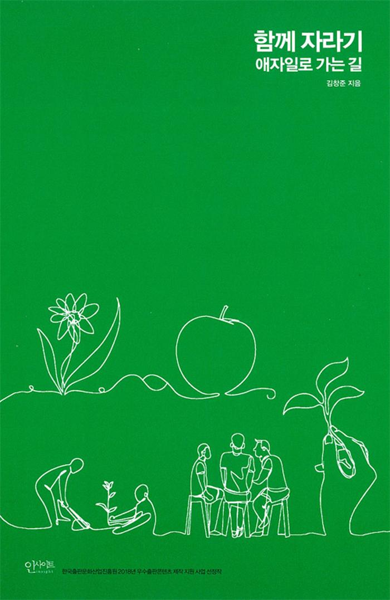

# 함께 자라기 (애자일로 가는 길)

📚[weet.io](https://smartstore.naver.com/weetbook/products/4776861530)
|
[쿠팡](https://coupa.ng/bmPcut)

## 블로그 리뷰

pr로 리뷰 링크 추가해주세요!

## 책 소개

모두가 함께 발전하기 위한 제안

‘함께’는 협력을 말하고, ‘자라기’는 학습을 말합니다. 무엇이건 실제 바깥세상(야생)에 임팩트를 남기려면 혼자 힘으로만 되는 게 없습니다. 함께 해야 합니다. 주변 사람들과 함께. 매일 부대끼는 동료들과 함께. 스스로 변하고 싶지만 계속 실패하는 사람, 조직을 개선하기 위한 시도를 하다가 오히려 데어본 사람, 불확실한 상황에서 합리적인 판단을 해야 하는 사람, 한 분야에서 전문성을 키워야 하는 사람에게 전문성을 키울 수 있는 제대로 된 방법을 알려줍니다. 어떤 분야에서 일하든 어느 위치에 있든 상관 없습니다. 이 책에서는 일하는 방법의 핵심과 통찰을 다룹니다. 개인의 힘으로는 극복할 수 없는 한계를 깨뜨리려면 모두가 같이 발전해야 합니다. 나 그리고 더 나아가 남을 변화시키는 삶에 대해 얘기합니다.

- 직원을 뽑을 때 무엇이 그 사람의 실력을 가장 잘 예측할까
- 수십 년 같은 일을 해도 전문가가 안 되는 이유와 제자리걸음에서 벗어나는 방법
- 커뮤니케이션과 협력을 잘하는 방안
- 리더의 역할과, 멘토링, 코칭 능력을 향상시키려면?
- 빠른 학습 능력을 보이는 탁월한 팀의 비밀
- 조직을 효과적으로 변화시키려면?

## 출판사 서평

다음 문장들을 보고 거짓이라고 생각하는 게 있으면 골라보세요.

1. 일반적으로 경력이 많으면 전문성도 높다.
2. 수십 년간 같은 수련을 날마다 반복하면 실력이 는다.
3. 실수는 최대한 예방하는 것이 좋고 그것이 가능하다.
4. 업무 중 공유를 하면 신뢰가 쌓인다.
5. 전문가들은 문제를 풀 때 하향식 접근(문제 이해, 분석, 설계, 구현 등의 순서)을 한다.
6. 전문가들로 팀을 만들면 성공률이 높아진다.
7. 독립적으로 일하는 팀원들이 각자 높은 확률로 일을 마칠 수 있다고 말하면 우리 팀이 일을 제대로 마칠 확률도 높다.
8. 애자일로 성공하고 싶으면 작은 실천부터 시도하는 것이 좋다.
9. 더 좋은 방법론을 도입하면 우리의 성공률이 올라갈 것이다.

몇 개나 거짓으로 고르셨나요? 사실 위의 진술들은 모두 거짓입니다. 대부분 우리의 직관과는 반대입니다. 이 책을 통해 왜 각각이 미신인지, 그렇다면 우리는 어떻게 해야 할지를 배울 수 있을 겁니다.

## 저자 소개

김창준

현재 애자일 컨설팅 대표이다. 2000년부터 한국에 애자일 방법론을 소개해 왔고, 이를 통해 기업과 개인 상대로 변화와 성장을 도와주는 일을 해오고 있다. 카카오, NHN, 삼성전자, 삼성SDS, LG전자, LGCNS, LG생활건강, LG U+, SK하이닉스, SK플래닛, GS홈쇼핑, 엔씨소프트, 넥슨, 외교부, 국방부, 한살림 등에 컨설팅과 교육을 제공한 바 있다. 2009년부터는 개인을 대상으로 AC2라는 교육 및 코칭 프로그램을 진행하고 있다.

## 목차

1 자라기 
당신은 몇 년 차? 
자기계발은 복리로 돌아온다 
학습 프레임과 실행 프레임 
가장 학습하기 힘든 직업이 살아남는다 
달인이 되는 비결 
수십 년 동안 전문가가 안 되는 비결 
당신이 제자리걸음인 이유 
의도적 수련의 일상적 예시 
프로그래밍 언어 배우기의 달인 
실수는 예방하는 것이 아니라 관리하는 것이다 
뛰어난 선생에 대한 미신 
나홀로 전문가에 대한 미신 

2 함께 
소프트웨어 관리자의 개선 우선순위 
협력을 통한 추상화 
신뢰를 깎는 공유인가 신뢰를 쌓는 공유인가 
객관성의 주관성 
이것도 모르세요? 
하향식 접근의 함정 
전문가팀이 실패하는 이유 
구글이 밝힌 탁월한 팀의 비밀 
쾌속 학습팀 
프로젝트 확률론 

3 애자일 
애자일의 씨앗 
애자일 도입 성공 요인 분석 
당신의 조직에 새 방법론이 먹히지 않는 이유 
애자일을 애자일스럽게 도입하기 

---
파트너스 활동을 통해 일정액의 수수료를 제공받을 수 있음