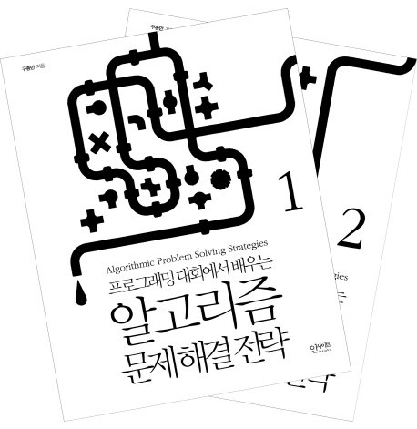

# 알고리즘 문제 해결 전략

📚[weet](https://smartstore.naver.com/weetbook/products/4776832290)
|
[쿠팡](https://coupa.ng/bmPf6V)

## 블로그 리뷰

pr로 리뷰 링크 추가해주세요!

## 책 소개

프로그래밍 대회에서 배우는『알고리즘 문제 해결 전략 세트』. 프로그래밍 대회 문제를 풀면서 각종 알고리즘 설계 기법과 자료 구조에 대해 배우고, 나아가 문제 해결 능력까지 키울 수 있도록 구성된 책이다. 각 장에는 독자가 스스로 프로그램을 작성해서 채점받을 수 있는 연습 문제들을 수록하였고, 모든 연습 문제에는 예제 답안과 답안을 설계하는 과정의 세세한 해설을 첨부하였다.

▶ 『알고리즘 문제 해결 전략』 1권부터 2권까지를 엮은 세트입니다. (전2권)

## 출판사 서평

이 책은 프로그래밍 대회 문제를 풀면서 각종 알고리즘 설계 기법과 자료 구조에 대해 배우고, 나아가 문제 해결 능력까지 키울 수 있도록 구성되어 있다. 각 장에는 독자가 스스로 프로그램을 작성해서 채점받을 수 있는 연습 문제들이 포함되어 있으며, 모든 연습 문제에는 예제 답안과 답안을 설계하는 과정의 세세한 해설이 첨부되어 있다.

이 책에서 다루는 내용 
1부 문제 해결 시작하기 
2부 알고리즘 분석 
3부 알고리즘 설계 패러다임 
4부 유명한 알고리즘들 
5부 기초 자료 구조 
6부 트리 
7부 그래프 

정오표와 소스코드는 이 책의 홈페이지(http://book.algospot.com)에서 확인하실 수 있습니다.

## 저자 소개

구종만
저자 구종만은 연세대학교 컴퓨터과학과 졸업한 후 이노티브와 NHN에서 소프트웨어 엔지니어로 일했고, 현재는 시카고의 고빈도거래(HFT) 회사에서 알고리즘 트레이딩 개발자로 일하고 있다. 2007년부터 한국 프로그래밍 대회 참가자 커뮤니티인 알고스팟의 운영에 참여하고 있다.

수상 경력:

2002년, 2003년 한국 대학생 프로그래밍 경시대회 금상

2003년, 2004년 세계 대학생 프로그래밍 경시대회 결승 진출

2004년, 2006년, 2008년 구글 코드 잼 결승 진출

2007년 탑코더 오픈 준우승, 2006년 결승 진출

2008년, 2009년 자바 알고리즘 콘테스트 우승

## 목차

==== 1권 ==== 
 
지은이의 글 
 
1부 문제 해결 시작하기 
__개관 
 
1장 문제 해결과 프로그래밍 대회 
__1.1 도입 
__1.2 프로그래밍 대회 
__1.3 이 책을 읽는 방법 
__1.4 국내에서 참가할 수 있는 프로그래밍 대회들 
__1.5 대회 준비를 위한 조언 
__1.6 더 읽을 거리 
 
2장 문제 해결 개관 
__2.1 도입 
__2.2 문제 해결 과정 
__2.3 문제 해결 전략 
__2.4 더 읽을거리 
 
3장 코딩과 디버깅에 관하여 
__3.1 도입: 코딩의 중요성을 간과하지 말라 
__3.2 좋은 코드를 짜기 위한 원칙 
__3.3 자주 하는 실수 
__3.4 디버깅과 테스팅 
__3.5 변수 범위의 이해 
__3.6 실수 자료형의 이해(optional) 
__3.7 더 읽을 거리 
 
2부 알고리즘 분석 
개관 
 
4장 알고리즘의 시간 복잡도 분석 
__4.1 도입 
__4.2 선형 시간 알고리즘 
__4.3 선형 이하 시간 알고리즘 
__4.4 지수 시간 알고리즘 
__4.5 시간 복잡도 
__4.6 수행 시간 어림짐작하기 
__4.7 계산 복잡도 클래스: P, NP, NP-완비 
__4.8 더 읽을 거리 
 
5장 알고리즘의 정당성 증명 
__5.1 도입 
__5.2 수학적 귀납법과 반복문 불변식 
__5.3 귀류법 
__5.4 다른 기술들 
__5.5 더 읽을 거리 
 
3부 알고리즘 설계 패러다임 
__개관 
 
6장 무식하게 풀기 
__6.1 도입 
__6.2 재귀 호출과 완전 탐색 
__6.3 문제: 소풍 (난이도: 하, 문제 ID: PICNIC) 
__6.4 풀이: 소풍 
__6.5 문제: 게임판 덮기 (난이도: 하, 문제 ID: BOARDCOVER) 
__6.6 풀이: 게임판 덮기 
__6.7 최적화 문제 
__6.8 문제: 시계 맞추기 (난이도: 중, 문제 ID: CLOCKSYNC) 
__6.9 풀이: 시계 맞추기 
__6.10 많이 등장하는 완전 탐색 유형 
 
7장 분할 정복 
__7.1 도입 
__7.2 문제: 쿼드 트리 뒤집기 (문제 ID: QUADTREE, 난이도: 하) 
__7.3 풀이: 쿼드 트리 뒤집기 
__7.4 문제: 울타리 잘라내기 (문제 ID: FENCE, 난이도: 중) 
__7.5 풀이: 울타리 잘라내기 
__7.6 문제: 팬 미팅 (문제 ID: FANMEETING, 난이도: 상) 
__7.7 풀이: 팬 미팅 
 
8장 동적 계획법 
__8.1 도입 
__8.2 문제: 와일드카드 (문제 ID: WILDCARD, 난이도: 중) 
__8.3 풀이: 와일드카드 
__8.4 전통적 최적화 문제들 
__8.5 문제: 합친 LIS (문제 ID: JLIS, 난이도: 하) 
__8.6 풀이: 합친 LIS 
__8.7 문제: 원주율 외우기 (문제 ID: PI, 난이도: 하) 
__8.8 풀이: 원주율 외우기 
__8.9 문제: Quantization (문제 ID: QUANTIZE, 난이도: 중) 
__8.10 풀이: Quantization 
__8.11 경우의 수와 확률 
__8.12 문제: 비대칭 타일링 (문제 ID: ASYMTILING, 난이도: 하) 
__8.13 풀이: 비대칭 타일링 
__8.14 문제: 폴리오미노 (문제 ID: POLY, 난이도: 중) 
__8.15 풀이: 폴리오미노 
__8.16 문제: 두니발 박사의 탈옥 (문제 ID: NUMB3RS, 난이도: 중) 
__8.17 풀이: 두니발 박사의 탈옥 
 
9장 동적 계획법 테크닉 
__9.1 최적화 문제의 실제 답 계산하기 
__9.2 문제: 여행 짐 싸기 (문제 ID: PACKING, 난이도: 중) 
__9.3 풀이: 여행 짐 싸기 
__9.4 문제: 광학 문자 인식 (문제 ID: OCR, 난이도: 상) 
__9.5 풀이: 광학 문자 인식 
__9.6 k번째 답 계산하기 
__9.7 문제: k번째 최대 증가 부분 수열 (문제 ID: KLIS, 난이도: 상) 
__9.8 풀이: k번째 최대 증가 부분 수열 
__9.9 문제: 드래곤 커브 (문제 ID: DRAGON, 난이도: 중) 
__9.10 풀이: 드래곤 커브 
__9.11 정수 이외의 입력에 대한 메모이제이션 
__9.12 문제: 웨브바짐 (문제 ID: ZIMBABWE, 난이도: 상) 
__9.13 풀이: 웨브바짐 
__9.14 문제: 실험 데이터 복구하기 (문제 ID: RESTORE, 난이도: 중) 
__9.15 풀이: 실험 데이터 복구하기 
__9.16 조합 게임 
__9.17 문제: 숫자 게임 (문제 ID: NUMBERGAME, 난이도: 하) 
__9.18 풀이: 숫자 게임 
__9.19 문제: 블록 게임 (문제 ID: BLOCKGAME, 난이도: 중) 
__9.20 풀이: 블록 게임 
__9.21 반복적 동적 계획법 
__9.22 문제: 회전초밥 (문제 ID: SUSHI, 난이도: 중) 
__9.23 풀이: 회전초밥 
__9.24 문제: 지니어스 (문제 ID: GENIUS, 난이도: 중) 
__9.25 풀이: 지니어스 
__9.26 더 읽을 거리 
 
10장 탐욕법 
__10.1 도입 
__10.2 문제: 도시락 데우기 (문제 ID: LUNCHBOX, 난이도: 하) 
__10.3 풀이: 도시락 데우기 
__10.4 문제: 문자열 합치기 (문제 ID: STRJOIN, 난이도: 중) 
__10.5 풀이: 문자열 합치기 
__10.6 문제: 미나스 아노르 (문제 ID: MINASTIRITH, 난이도: 상) 
__10.7 풀이: 미나스 아노르 
 
11장 조합 탐색 
__11.1 도입 
__11.2 조합 탐색 기법들 
__11.3 문제: 게임판 덮기 2 (문제 ID: BOARDCOVER2, 난이도: 하) 
__11.4 풀이: 게임판 덮기 2 
__11.5 문제: 알러지가 심한 친구들 (문제 ID: ALLERGY, 난이도: 중) 
__11.6 풀이: 알러지가 심한 친구들 
__11.7 문제: 카쿠로 (문제 ID: KAKURO2, 난이도: 중) 
__11.8 풀이: 카쿠로 
__11.9 더 읽을거리 
 
12장 최적화 문제 결정 문제로 바꿔 풀기 
__12.1 도입 
__12.2 문제: 남극 기지 (문제 ID: ARCTIC, 난이도: 하) 
__12.3 풀이: 남극 기지 
__12.4 문제: 캐나다 여행 (문제 ID: CANADATRIP, 난이도: 중) 
__12.5 풀이: 캐나다 여행 
__12.6 문제: 수강 철회 (문제 ID: WITHDRAWAL, 난이도: 상) 
__12.7 풀이: 수강 철회 
 
4부 유명한 알고리즘들 
__개관 
 
13장 수치 해석 
__13.1 도입 
__13.2 이분법 
__13.3 문제: 승률 올리기 (문제 ID: RATIO, 난이도: 하) 
__13.4 풀이: 승률 올리기 
__13.5 삼분 검색 
__13.6 문제: 꽃가루 화석 (문제 ID: FOSSIL, 난이도: 상) 
__13.7 풀이: 꽃가루 화석 
__13.8 다른 주제들 
 
14장 정수론 
__14.1 도입 
__14.2 소수 
__14.3 문제: 비밀번호 486 (문제 ID: PASS486, 난이도: 중) 
__14.4 풀이: 비밀번호 486 
__14.5 유클리드 알고리즘 
__14.6 문제: 마법의 약 (문제 ID: POTION, 난이도: 중) 
__14.7 풀이: 마법의 약 
__14.8 모듈라 연산 
__14.9 더 읽을거리(optional) 
 
15장 계산 기하 
__15.1 도입 
__15.2 계산 기하의 도구들 
__15.3 교차와 거리, 면적 
__15.4 문제: 핀볼 시뮬레이션 (문제 ID: PINBALL, 난이도: 상) 
__15.5 풀이: 핀볼 시뮬레이션 
__15.6 다각형 
__15.7 문제: 보물섬 (문제 ID: TREASURE, 난이도: 상) 
__15.8 풀이: 보물섬 
__15.9 문제: 너드인가, 너드가 아닌가? (문제 ID: NERDS, 난이도: 중) 
__15.10 풀이: 너드인가, 너드가 아닌가? 
__15.11 계산 기하 알고리즘 디자인 패턴 
__15.12 자주 하는 실수와 유의점들 
__15.13 더 읽을거리 
 
==== 2권 ==== 
 
5부 기초 자료 구조 
__개관 
 
16장 비트마스크 
__16.1 도입 
__16.2 비트마스크를 이용한 집합의 구현 
__16.3 비트마스크의 응용 예제 
__16.4 문제: 졸업 학기 (문제 ID: GRADUATION, 난이도: 중) 
__16.5 풀이: 졸업 학기 
__16.6 더 읽을거리 
 
17장 부분 합 
__17.1 도입 
__17.2 문제: 크리스마스 인형 (문제 ID: CHRISTMAS, 난이도: 중) 
__17.3 풀이: 크리스마스 인형 
__17.4 더 공부할 거리 
 
18장 선형 자료 구조 
__18.1 도입 
__18.2 동적 배열 
__18.3 연결 리스트 
__18.4 동적 배열과 연결 리스트의 비교 
__18.5 문제: 조세푸스 문제 (문제 ID: JOSEPHUS, 난이도: 하) 
__18.6 풀이: 조세푸스 문제 
__18.7 더 읽을 거리 
 
19장 큐와 스택, 데크 
__19.1 도입 
__19.2 큐와 스택, 데크의 구현 
__19.3 스택과 큐의 활용 
__19.4 문제: 짝이 맞지 않는 괄호 (문제 ID: BRACKETS2, 난이도: 하) 
__19.5 풀이: 짝이 맞지 않는 괄호 
__19.6 문제: 외계 신호 분석 (문제 ID: ITES, 난이도: 중) 
__19.7 풀이: 외계 신호 분석 
 
20장 문자열 
__20.1 도입 
__20.2 문자열 검색 
__20.3 문제: 재하의 금고 (문제 ID: JAEHASAFE, 난이도: 중) 
__20.4 풀이: 재하의 금고 
__20.5 접미사 배열 
__20.6 문제: 말버릇 (문제 ID: HABIT, 난이도: 중) 
__20.7 풀이: 말버릇 
__20.8 더 읽을거리 
 
6부 트리 
__개관 
 
21장 트리의 구현과 순회 
__21.1 도입 
__21.2 트리의 순회 
__21.3 문제: 트리 순회 순서 변경 (문제 ID: TRAVERSAL, 난이도: 하) 
__21.4 풀이: 트리 순회 순서 변경 
__21.5 문제: 요새 (문제 ID: FORTRESS, 난이도: 중) 
__21.6 풀이: 요새 
 
22장 이진 검색 트리 
__22.1 도입 
__22.2 이진 검색 트리의 정의와 조작 
__22.3 시간 복잡도 분석과 균형 잡힌 이진 검색 트리 
__22.4 문제: 너드인가, 너드가 아닌가? 2 (문제 ID: NERD2, 난이도: 중) 
__22.5 풀이: 너드인가, 너드가 아닌가? 2 
__22.6 균형 잡힌 이진 검색 트리 직접 구현하기: 트립 
__22.7 문제: 삽입 정렬 뒤집기 (문제 ID: INSERTION, 난이도: 중) 
__22.8 풀이: 삽입 정렬 뒤집기 
 
23장 우선순위 큐와 힙 
__23.1 도입 
__23.2 힙의 정의와 구현 
__23.3 문제: 변화하는 중간 값 (문제 ID: RUNNINGMEDIAN, 난이도: 하) 
__23.4 풀이: 변화하는 중간 값 
 
24장 구간 트리 
__24.1 구간 트리: 구간에 대한 질문 대답하기 
__24.2 문제: 등산로 (문제 ID: MORDOR, 난이도: 중) 
__24.3 풀이: 등산로 
__24.4 문제: 족보 탐험 (문제 ID: FAMILYTREE, 난이도: 상) 
__24.5 풀이: 족보 탐험 
__24.6 펜윅 트리: 빠르고 간단한 구간 합 
__24.7 문제: 삽입 정렬 시간 재기 (문제 ID: MEASURETIME, 난이도: 중) 
__24.8 풀이: 삽입 정렬 시간 재기 
 
25장 상호 배타적 집합 
__25.1 도입 
__25.2 문제: 에디터 전쟁 (문제 ID: EDITORWARS, 난이도: 중) 
__25.3 풀이: 에디터 전쟁 
 
26장 트라이 
__26.1 도입 
__26.2 문제: 안녕히, 그리고 물고기는 고마웠어요! (문제 ID: SOLONG, 난이도: 중) 
__26.3 풀이: 안녕히, 그리고 물고기는 고마웠어요! 
__26.4 트라이를 이용한 다중 문자열 검색 
__26.5 문제: 보안종결자 (문제 ID: NH, 난이도: 상) 
__26.6 풀이: 보안종결자 
 
7부 그래프 
__개관 
 
27장 그래프의 표현과 정의 
__27.1 도입 
__27.2 그래프의 사용 예 
__27.3 암시적 그래프 구조들 
__27.4 그래프의 표현 방법 
 
28장 그래프의 깊이 우선 탐색 
__28.1 도입 
__28.2 문제: 고대어 사전 (문제 ID: DICTIONARY, 난이도: 하) 
__28.3 풀이: 고대어 사전 
__28.4 오일러 서킷 
__28.5 문제: 단어 제한 끝말잇기 (문제 ID: WORDCHAIN, 난이도: 하) 
__28.6 풀이: 단어 제한 끝말잇기 
__28.7 이론적 배경과 응용 
__28.8 문제: 감시 카메라 설치 (문제 ID: GALLERY, 난이도: 중) 
__28.9 풀이: 감시 카메라 설치 
__28.10 문제: 회의실 배정 (문제 ID: MEETINGROOM, 난이도: 상) 
__28.11 풀이: 회의실 배정 
 
29장 그래프의 너비 우선 탐색 
__29.1 도입 
__29.2 문제: Sorting Game (문제 ID: SORTGAME, 난이도: 중) 
__29.3 풀이: Sorting Game 
__29.4 문제: 어린이날 (문제 ID: CHILDRENDAY, 난이도: 상) 
__29.5 풀이: 어린이날 
__29.6 최단 경로 전략 
__29.7 문제: 하노이의 탑 (문제 ID: HANOI4B, 난이도: 중) 
__29.8 풀이: 하노이의 탑 
 
30장 최단 경로 알고리즘 
__30.1 도입 
__30.2 다익스트라의 최단 경로 알고리즘 
__30.3 문제: 신호 라우팅 (문제 ID: ROUTING, 난이도: 하) 
__30.4 풀이: 신호 라우팅 
__30.5 문제: 소방차 (문제 ID: FIRETRUCKS, 난이도: 중) 
__30.6 풀이: 소방차 
__30.7 문제: 철인 N종 경기 (문제 ID: NTHLON, 난이도: 상) 
__30.8 풀이: 철인 N종 경기 
__30.9 벨만-포드의 최단 경로 알고리즘 
__30.10 문제: 시간여행 (문제 ID: TIMETRIP, 난이도: 중) 
__30.11 풀이: 시간여행 
__30.12 플로이드의 모든 쌍 최단 거리 알고리즘 
__30.13 문제: 음주 운전 단속 (문제 ID: DRUNKEN, 난이도: 중) 
__30.14 풀이: 음주 운전 단속 
__30.15 문제: 선거 공약 (문제 ID: PROMISES, 난이도: 중) 
__30.16 풀이: 선거 공약 
 
31장 최소 스패닝 트리 
__31.1 도입 
__31.2 크루스칼의 최소 스패닝 트리 알고리즘 
__31.3 프림의 최소 스패닝 트리 알고리즘 
__31.4 문제: 근거리 네트워크 (문제 ID: LAN, 난이도: 하) 
__31.5 풀이: 근거리 네트워크 
__31.6 문제: 여행 경로 정하기 (문제 ID: TPATH, 난이도: 상) 
__31.7 풀이: 여행 경로 정하기 
 
32장 네트워크 유량 
__32.1 도입 
__32.2 포드-풀커슨 알고리즘 
__32.3 네트워크 모델링 
__32.4 문제: 승부 조작 (문제 ID: MATCHFIX, 난이도: 중) 
__32.5 풀이: 승부 조작 
__32.6 문제: 국책 사업 (문제 ID: PROJECTS, 난이도: 상) 
__32.7 풀이: 국책 사업 
__32.8 이분 매칭 
__32.9 문제: 비숍 (문제 ID: BISHOPS, 난이도: 중) 
__32.10 풀이: 비숍 
__32.11 문제: 함정 설치 (문제 ID: TRAPCARD, 난이도: 상) 
__32.12 풀이: 함정 설치 
__32.13 더 공부할 거리

---
파트너스 활동을 통해 일정액의 수수료를 제공받을 수 있음