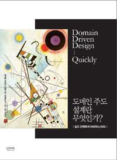

# 도메인 주도 설계란 무엇인가? (쉽고 간략하게 이해하는 DDD)

## 책 사러 가기

📚[weet](https://smartstore.naver.com/weetbook/products/4776835955)
|
[쿠팡](https://coupa.ng/bnd7Rk)

## 책 소개

거대한 소프트웨어 프로젝트가 직면하는 가장 어려운 고비는 구현 자체가 아니라 소프트웨어가 적용될 실제 도메인이다. 도메인 기반 설계는 도메인에 어떻게 접근해야 하는지, 거기서 얻은 정보를 어떻게 활용해야 소프트웨어에 온전하게 적용될 수 있는지를 알려주는 접근법이다. DDD는 에릭 에반스의 책 『Domain Driven Design』(이하 『DDD』)으로 널리 전파되었는데, 『도메인 주도 설계란 무엇인가?: 쉽고 간략하게 이해하는 DDD』는 에릭 에반스가 『DDD』에서 전하려고 했던 바를 내용의 훼손이나 가감 없이 정리해 요약하고자 한 책이다. 내용을 간결하게 정리했기 때문에 빠르게 읽으며 DDD를 파악할 수 있다는 것이 이 책의 장점이다.

## 출판사 서평

거대한 소프트웨어 프로젝트가 직면하는 가장 어려운 고비는 구현 자체가 아니라 소프트웨어가 적용될 실제 도메인이다. 도메인 기반 설계는 도메인에 어떻게 접근해야 하는지, 거기서 얻은 정보를 어떻게 활용해야 소프트웨어에 온전하게 적용될 수 있는지를 알려주는 접근법이다. DDD는 에릭 에반스의 책 『Domain Driven Design』(이하 『DDD』)으로 널리 전파되었는데, 『도메인 주도 설계란 무엇인가?: 쉽고 간략하게 이해하는 DDD』는 에릭 에반스가 『DDD』에서 전하려고 했던 바를 내용의 훼손이나 가감 없이 정리해 요약하고자 한 책이다. 내용을 간결하게 정리했기 때문에 빠르게 읽으며 DDD를 파악할 수 있다는 것이 이 책의 장점이다.

이 책에 담긴 내용
- 도메인 지식 구축하기
- 유비쿼터스 언어
- 모델 기반 디자인
- 깊이 있는 통찰을 위한 리팩터링
- 모델 온전하게 보존하기
** 에릭 에반스와의 인터뷰 수록

에릭 에반스
『Domain-Driven Design : Tackling Complexity in Software』 (Addison-Wesley 2004) 의 저자다.
1990년대부터 많은 프로젝트에서 일하며 객체를 이용해 다양하게 접근하여 여러 결과를 내면서 대규모 시스템을 개발해 왔다. 앞서 말한 책은 그 경험의 총합이다. 성공적인 팀이 복잡한 소프트웨어 시스템을 비즈니스 요구에 맞추어 나가면서, 시스템이 커져나가는 데 따라서 프로젝트가 기민하게 대응하도록 하는 모델링과 설계 기술의 체계를 책에 담아 표현한다.
지금 에릭은 개발 작업이 해당 비즈니스에 좀 더 생산적이고 가치 있게 하는 DDD를 적용하도록 코치하는 컨설팅 그룹인 ‘Domain Language’를 이끌고 있다.

## 저자 소개

저자 에이벨 아브람 (Abel Avram)
InfoQ 팀에 속해 플로이드와 함께 에릭 에반스의 『Domain Driven Design』을 요약해 정리했다. 에이벨은 C4Media의 에디토리얼 매니저이기도 한데, C4Media는 InfoQ를 유용하고 영향력 있는 소프트웨어 개발 커뮤니티로 성장시키는 데 초점을 둔 출판 그룹이다. http://www.infoq.com/에서 IT 이슈에 대한 에이벨의 글을 볼 수 있다.

저자 플로이드 마리네스쿠 (Floyd Marinescu)
InfoQ.com와 Qcon 컨퍼런스의 공동 창립자이자 CEO다. 플로이즈는 InfoQ.com의 수석 에디터였으며, 2002년에는 『EJB Design Patterns』를 집필하였다. 현재 TheServerSide.com, TheServerSide.Net, TheServerSide Java Symposium conferences를 만들어 운영 중이다.

역자 최수경
덕성여대 전산과를 졸업했고, 카네기멜론 소프트웨어 공학 연수 과정을 수료하였다. 주요 참여 프로젝트로는 대법원 등기 시스템 2003, 대법원 민사 시스템 2002, 사우디 교육부 Smart School 시스템 2008 등이 있으며, 7년간 객체지향 분석/설계를 강의했다. 정보공학, 객체지향, CBD, SOA 등 다양한 모델링 기법에 흥미를 갖고 있으며, 최근에는 애자일 및 품질 보증 활동에 관심을 두고 있다. LG CNS에서 15년째 재직 중이며, 현재 금융 차세대 프로젝트에서 품질 담당자로 변신을 도모 중이다.

## 목차

옮긴이의 글 
서문 쉽고 간략하게 이해하는 DDD를 왜 쓰게 되었는가? 
들어가기 전에 
 
1장 도메인 주도 설계란 무엇인가? 
도메인 지식 쌓기 

2장 유비쿼터스 언어 
공통 언어의 필요성 
유비쿼터스 언어 만들기 

3장 모델 주도 설계 
모델 주도 설계를 위한 블록 
계층형 아키텍처 
엔티티 
값 객체 
서비스 
모듈 
집합 
팩토리 
리파지토리 

4장 깊은 통찰을 향한 리팩터링 
지속적인 리팩터링 
핵심 개념 드러내기 

5장 모델 무결성 보존 
분할된 컨텍스트 
지속적인 통합 
컨텍스트 맵 
공유 커널 
고객-공급자 
순응 
변질 방지 레이어 
분할 방식 
오픈 호스트 서비스 
증류 

6장 오늘날 DDD는 중요하다 
에릭 에반스 인터뷰

---
파트너스 활동을 통해 일정액의 수수료를 제공받을 수 있음