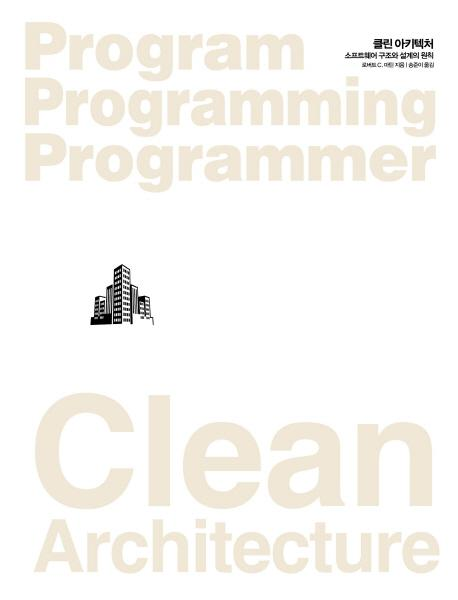

# 클린 아키텍처 (소프트웨어 구조와 설계의 원칙)

## 책 사러 가기

📚[weet](https://smartstore.naver.com/weetbook/products/4776836516)
|
[쿠팡](https://coupa.ng/bnd8lT)

## 책 소개

“살아있는 전설이 들려주는 실용적인 소프트웨어 아키텍처 원칙”

소프트웨어 아키텍처의 보편 원칙을 적용하면 소프트웨어 수명 전반에서 개발자 생산성을 획기적으로 끌어올릴 수 있다. 《클린 코드》와 《클린 코더》의 저자이자 전설적인 소프트웨어 장인인 로버트 C. 마틴은 이 책 《클린 아키텍처》에서 이러한 보편 원칙들을 설명하고 여러분이 실무에 적용할 수 있도록 도와준다.

단순히 선택지들을 나열하는 책이 아니다. 상상할 수 있는 모든 분야의 소프트웨어 환경에서 반 세기를 살아온 저자의 경험에 기초하여, 성공하기 위해서는 어떤 선택을 해야 하고 무엇이 결정적인지를 이야기해 준다. 저자의 명성에 걸맞게 이 책에는 여러분이 직면할 현실적인 도전들을 극복할 수 있는 진지한 해결책으로 가득 차 있다.

## 출판사 서평

이 책에서 다루는 내용
* 소프트웨어 아키텍트가 해내야 할 일과 그 일을 해내기 위한 규율과 실천법을 배운다.
* 기능, 구성요소 분리, 데이터 관리를 위한 소프트웨어 설계 핵심 원칙을 숙달한다.
* 프로그래밍 패러다임이 규율을 강제하기 위해 개발자의 자유를 어떻게 제약하는지 알아본다.
* 무엇이 정말 중요하고, 무엇이 중요치 않은 ‘세부사항’인지 이해한다.
* 웹, 데이터베이스, 리치 클라이언트, 콘솔, 임베디드 애플리케이션의 고수준 구조를 최적화한다.
* 구성요소 혹은 서비스 사이의 경계와 계층을 제대로 정의한다.
* 아키텍처가 잘못되는 이유와 잘못된 결과가 나오지 않게 예방하거나 고치는 방법을 배운다.

이 책은 모든 소프트웨어 아키텍트, 시스템 분석가, 설계자, 소프트웨어 관리자는 물론 다른 사람의 설계를 구현해 내야 하는 모든 프로그래머가 읽어야 하는 필독서다.

## 저자 소개

저자 로버트 C. 마틴
(ROBERT C. MARTIN)

“밥 아저씨(UNCLE BOB)”로 불리기도 한다. 1970년부터 프로그래머로 활동했다. 전 세계 콘퍼런스에서 호평받는 연사이며, 《클린 코드》, 《UML 실전에서는 이것만 쓴다》, 《클린 코더》, 《클린 소프트웨어》의 저자다. ‘엉클 밥 컨설팅(UNCLE BOB CONSULTING, LLC)’의 창립자이자 ‘클린 코더(CLEAN CODERS, LLC)’의 공동 창립자다. 또한 ‘애자일 얼라이언스(AGILE ALLIANCE)’의 초대 회장과 《THE C++ REPORT》의 편집장을 지냈으며 ‘오브젝트 멘토(OBJECT MENTOR)’의 공동 창립자이자 리더다.

역자 송준이

대기업에서 SI로 개발을 시작했고, 멜론에서 빅데이터와 검색엔진 시스템을 개발했다. 스타트업에 대한 동경으로 재능마켓, 인공지능 업체에서 일하기도 했다. 지금은 동대문 패션 플랫폼 스타트업인 ‘와이즈패션’에서 일하고 있다.

## 목차
=== 1부 소개 === 
1장 설계와 아키텍처란? 
__목표는? 
__사례 연구 
__결론 
 
2장 두 가지 가치에 대한 이야기 
__행위 
__아키텍처 
__더 높은 가치 
__아이젠하워 매트릭스 
__아키텍처를 위해 투쟁하라 
 
=== 2부 벽돌부터 시작하기: 프로그래밍 패러다임 === 
3장 패러다임 개요 
__구조적 프로그래밍 
__객체 지향 프로그래밍 
__함수형 프로그래밍 
__생각할 거리 
__결론 
 
4장 구조적 프로그래밍 
__증명 
__해로운 성명서 
__기능적 분해 
__엄밀한 증명은 없었다 
__과학이 구출하다 
__테스트 
__결론 
 
5장 객체 지향 프로그래밍 
__캡슐화? 
__상속? 
__다형성? 
__결론 
 
6장 함수형 프로그래밍 
__정수를 제곱하기 
__불변성과 아키텍처 
__가변성의 분리 
__이벤트 소싱 
__결론 
 
=== 3부 설계 원칙 === 
7장 SRP: 단일 책임 원칙 
__징후 1: 우발적 중복 
__징후 2: 병합 
__해결책 
__결론 
 
8장 OCP: 개방-폐쇄 원칙 
__사고 실험 
__방향성 제어 
__정보 은닉 
__결론 
 
9장 LSP: 리스코프 치환 원칙 
__상속을 사용하도록 가이드하기 
__정사각형/직사각형 문제 
__LSP와 아키텍처 
__LSP 위배 사례 
__결론 
 
10장 ISP: 인터페이스 분리 원칙 
__ISP와 언어 
__ISP와 아키텍처 
__결론 
 
11장 DIP: 의존성 역전 원칙 
__안정된 추상화 
__팩토리 
__구체 컴포넌트 
__결론 
 
=== 4부 컴포넌트 원칙 === 
12장 컴포넌트 
__컴포넌트의 간략한 역사 
__재배치성 
__링커 
__결론 
 
13장 컴포넌트 응집도 
__REP: 재사용/릴리스 등가 원칙 
__CCP: 공통 폐쇄 원칙 
__CRP: 공통 재사용 원칙 
__컴포넌트 응집도에 대한 균형 다이어그램 
__결론 
 
14장 컴포넌트 결합 
__ADP: 의존성 비순환 원칙 
__하향식(top-down) 설계 
__SDP: 안정된 의존성 원칙 
__SAP: 안정된 추상화 원칙 
__결론 
 
=== 5부 아키텍처 === 
15장 아키텍처란? 
__개발 
__배포 
__운영 
__유지보수 
__선택사항 열어 두기 
__장치 독립성 
__광고 우편 
__물리적 주소 할당 
__결론 
 
16장 독립성 
__유스케이스 
__운영 
__개발 
__배포 
__선택사항 열어놓기 
__계층 결합 분리 
__유스케이스 결합 분리 
__결합 분리 모드 
__개발 독립성 
__배포 독립성 
__중복 
__결합 분리 모드(다시) 
__결론 
 
17장 경계: 선 긋기 
__두 가지 슬픈 이야기 
__FitNesse 
__어떻게 선을 그을까? 그리고 언제 그을까? 
__입력과 출력은? 
__플러그인 아키텍처 
__플러그인에 대한 논의 
__결론 
 
18장 경계 해부학 
__경계 횡단하기 
__두려운 단일체 
__배포형 컴포넌트 
__스레드 
__로컬 프로세스 
__서비스 
__결론 
 
19장 정책과 수준 
__수준 
__결론 
 
20장 업무 규칙 
__엔티티 
__유스케이스 
__요청 및 응답 모델 
__결론 
 
21장 소리치는 아키텍처 
__아키텍처의 테마 
__아키텍처의 목적 
__하지만 웹은? 
__프레임워크는 도구일 뿐, 삶의 방식은 아니다 
__테스트하기 쉬운 아키텍처 
__결론 
 
22장 클린 아키텍처 
__의존성 규칙 
__전형적인 시나리오 
__결론 
 
23장 프레젠터와 험블 객체 
__험블 객체 패턴 
__프레젠터와 뷰 
__테스트와 아키텍처 
__데이터베이스 게이트웨이 
__데이터 매퍼 
__서비스 리스너 
__결론 
 
24장 부분적 경계 
__마지막 단계를 건너뛰기 
__일차원 경계 
__퍼사드 
__결론 
 
25장 계층과 경계 
__움퍼스 사냥 게임 
__클린 아키텍처? 
__흐름 횡단하기 
__흐름 분리하기 
__결론 
 
26장 메인(Main) 컴포넌트 
__궁극적인 세부사항 
__결론 
 
27장 ‘크고 작은 모든’ 서비스들 
__서비스 아키텍처? 
__서비스의 이점? 
__야옹이 문제 
__객체가 구출하다 
__컴포넌트 기반 서비스 
__횡단 관심사 
__결론 
 
28장 테스트 경계 
__시스템 컴포넌트인 테스트 
__테스트를 고려한 설계 
__테스트 API 
__결론 
 
29장 클린 임베디드 아키텍처 
__앱-티튜드 테스트 
__타깃-하드웨어 병목현상 
__결론 
 
=== 6부 세부사항 === 
30장 데이터베이스는 세부사항이다 
__관계형 데이터베이스 
__데이터베이스 시스템은 왜 이렇게 널리 사용되는가? 
__디스크가 없다면 어떻게 될까? 
__세부사항 
__하지만 성능은? 
__개인적인 일화 
__결론 
 
31장 웹은 세부사항이다 
__끝없이 반복하는 추 
__요약 
__결론 
 
32장 프레임워크는 세부사항이다 
__프레임워크 제작자 
__혼인 관계의 비대칭성 
__위험 요인 
__해결책 
__이제 선언합니다 
__결론 
 
33장 사례 연구: 비디오 판매 
__제품 
__유스케이스 분석 
__컴포넌트 아키텍처 
__의존성 관리 
__결론 
 
34장 빠져 있는 장 
__계층 기반 패키지 
__기능 기반 패키지 
__포트와 어댑터 
__컴포넌트 기반 패키지 
__구현 세부사항엔 항상 문제가 있다 
__조직화 vs. 캡슐화 
__다른 결합 분리 모드 
__결론: 빠져 있는 조언 
 
=== 7부 부록 === 
부록 A 아키텍처 고고학

---
파트너스 활동을 통해 일정액의 수수료를 제공받을 수 있음