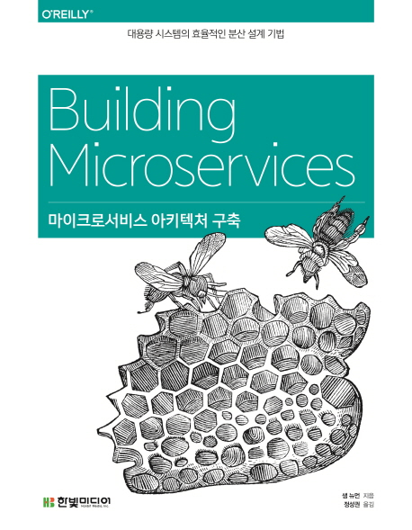

# 마이크로서비스 아키텍처 구축 (대용량 시스템의 효율적인 분산 설계 기법)

📚[weet](https://smartstore.naver.com/weetbook/products/4776832946)
|
[쿠팡](https://coupa.ng/bmUxBn)

## 블로그 리뷰

pr로 리뷰 링크 추가해주세요!

## 책 소개

마이크로서비스 입문에서 구축과 활용까지!

마이크로서비스는 기존 대용량 시스템의 복잡성과 운영 ㆍ배포 ㆍ유지보수의 문제점을 해결할 새로운 대안이다. 이 책은 마이크로서비스 아키텍처를 구축, 관리할 때 고려할 문제와 이에 관한 포괄적 시각과 실용적인 조언을 제공한다. 지속적 통합을 통해 개별 마이크로서비스를 배포하는 과정을 설명하고, 실제로 마이크로서비스를 도입한 기업들의 구체적 사례를 소개한다.

## 출판사 서평

★ 마이크로서비스, 웹 기반 분산 시스템의 디자인 패러다임을 바꾸다!

_주요 내용
● 마이크로서비스 아키텍처 소개란?
● 조직의 목표에 맞게 시스템 설계하기
● 모놀리식 코드베이스의 점진적 분리 방법
● 운용 중인 레거시 시스템과 서비스의 통합 방안
● 지속적 통합으로 개별 마이크로서비스 배포
● 분산 서비스 테스팅과 모니터링의 복잡성 고찰
● <사용자-서비스>와 <서비스-서비스> 모델의 보안 관리
● 마이크로서비스 도입 기업의 구체적 사례
● 마이크로서비스 아키텍처 확장을 위한 도전

_대상 독자
- 기업 시스템 아키텍트 및 프로그래머, 프로젝트 관리 담당자
- 시스템 배포 및 테스팅, 유지 보수에 관심 있는 IT 업계 종사자
- 대용량 시스템의 효율적 분산 설계에 관심 있는 기업 CEO 및 경영진

## 저자 소개

샘 뉴먼

저자 샘 뉴먼 SAM NEWMAN은 소트웍스 사에서 고객사의 사내 시스템을 설계하는 아키텍트로 일하고 있다. 여러 나라 여러 분야의 회사들과 협업하며 개발과 IT 운영 영역을 넘나들어 왔다. 그에게 어떤 일을 하는지 묻는다면 ‘사람들과 함께 더 나은 소프트웨어 시스템을 만드는 일을 합니다’라고 답할 것이다. 샘은 기사를 쓰고, 컨퍼런스에서 발표하며, 가끔 오픈 소스 프로젝트에 커밋하고 있다.

정성권

역자 정성권은 팜, 심비안, 바다 스마트폰 소프트웨어와 모바일 보안 플랫폼인 KNOX 기업용 서비스의 개발을 담당했으며 현재 마이크로서비스 기반의 IOT 서비스를 개발한다. 대규모 분산 시스템 설계와 운영 방법론에 주목해 왔으며 최근에는 RX, DROPWIZARD와 RATPACK을 통한 반응형/비동기 프로그래밍에 관심이 많다. 공저로 『ABOUT.NET XML 웹 서비스』(영진닷컴, 2002)와 『PHP 웹 서버 구축하기』(사이버출판사, 2000)가 있다.

## 목차

1장. 마이크로서비스 
__1.1 마이크로서비스란 
__1.2 주요 혜택 
__1.3 서비스 지향 아키텍처란 
__1.4 기타 분해 기술 
__1.5 은총알은 없다 
__1.6 마치며 
 
2장. 진화적 아키텍트 
__2.1 부정확한 비교 
__2.2 아키텍트에 대한 진화적 관점 
__2.3 구역화 
__2.4 원칙적인 접근법 
__2.5 필수 기준 
__2.6 코드를 통한 통제 
__2.7 기술 부채 
__2.8 예외 처리 
__2.9 중앙에서의 거버넌스와 지휘 
__2.10 팀 만들기 
__2.11 마치며 
 
3장. 서비스 모델링하기 
__3.1 뮤직코퍼레이션 소개 
__3.2 무엇이 좋은 서비스를 만드는가? 
__3.3 경계가 있는 콘텍스트 
__3.4 비즈니스 능력 
__3.5 거북이 밑에 거북이 
__3.6 비즈니스 콘셉트 관점에서의 커뮤니케이션 
__3.7 기술적 경계 
__3.8 마치며 
 
4장. 통합 
__4.1 이상적인 통합 기술 모색 
__4.2 고객과의 인터페이싱 
__4.3 공유 데이터베이스 
__4.4 동기와 비동기 
__4.5 오케스트레이션과 코레오그래피 
__4.6 원격 프로시저 호출 
__4.7 REST 
__4.8 비동기 이벤트 기반의 협업 구현 
__4.9 상태 기계로서의 서비스 
__4.10 반응형 확장 
__4.11 마이크로서비스 세계에서 코드 재사용의 위험과 DRY 
__4.12 참조에 의한 접근 
__4.13 버전 관리 
__4.14 사용자 인터페이스 
__4.15 외부 소프트웨어와 통합 
__4.16 마치며 
 
5장. 모놀리스 분해하기 
__5.1 접합부가 중요하다 
__5.2 뮤직코퍼레이션 분해하기 
__5.3 모놀리스를 분리하는 이유 
__5.4 뒤엉킨 의존성 
__5.5 데이터베이스 
__5.6 문제에 대처하기 
__5.7 예: 외부 키 관계 깨뜨리기 
__5.8 예: 공유된 정적 데이터 
__5.9 예: 공유 데이터 
__5.10 예: 공유된 테이블 
__5.11 데이터베이스 리팩토링 
__5.12 트랜잭션의 경계 
__5.13 리포팅 
__5.14 리포팅 데이터베이스 
__5.15 서비스 호출을 통한 데이터 추출 
__5.16 데이터 펌프 
__5.17 이벤트 데이터 펌프 
__5.18 백업 데이터 펌프 
__5.19 실시간을 향해 
__5.20 변경 비용 
__5.21 원인 파악 
__5.22 마치며 
 
6장. 배포 
__6.1 지속적 통합이란 
__6.2 지속적 통합을 마이크로서비스로 매핑하기 
__6.3 빌드 파이프라인과 지속적 배포 
__6.4 플랫폼별 산출물 
__6.5 운영 체제 산출물 
__6.6 커스텀 이미지 
__6.7 환경 
__6.8 서비스 환경 구성 
__6.9 서비스와 호스트 매핑 
__6.10 자동화 
__6.11 물리 머신에서 가상화로 
__6.12 배포 인터페이스 
__6.13 마치며 
 
7장. 테스팅 
__7.1 테스트의 종류 
__7.2 테스트의 범위 
__7.3 서비스 테스트 구현하기 
__7.4 까다로운 엔드 투 엔드 테스트 
__7.5 엔드 투 엔드 테스팅의 단점 
__7.6 신뢰할 수 없고 취약한 테스트 
__7.7 스토리가 아닌 테스트 여정 
__7.8 우리를 구할 소비자 주도 테스트 
__7.9 엔드 투 엔드 테스트를 사용해야 하는가? 
__7.10 출시 후의 테스팅 
__7.11 교차기능 테스트 
__7.12 마치며 
 
8장. 모니터링 
__8.1 단일 서비스, 단일 서버 
__8.2 단일 서비스, 다수 서버 
__8.3 다수 서비스, 다수 서버 
__8.4 로그, 로그, 더 많은 로그... 
__8.5 다수 서비스 간의 측정지표 추적 
__8.6 서비스 측정지표 
__8.7 합성 모니터링 
__8.8 상관관계 ID 
__8.9 전파 
__8.10 표준화 
__8.11 관객 고려하기 
__8.12 앞으로 
__8.13 마치며 
 
9장. 보안 
__9.1 인증과 권한부여 
__9.2 서비스 대 서비스 인증과 권한부여 
__9.3 보관 중인 데이터 보호하기 
__9.4 심층 방어 
__9.5 시범 예제 
__9.6 절약하라 
__9.7 인적 요소 
__9.8 황금률 
__9.9 보안 탑재 
__9.10 외부 검증 
__9.11 마치며 
 
10장. 콘웨이의 법칙과 시스템 설계 
__10.1 증거 
__10.2 넷플릭스와 아마존 
__10.3 이것으로 무엇을 할 수 있을까? 
__10.4 의사소통 경로 적응 
__10.5 서비스 소유권 
__10.6 공유된 서비스의 추진 
__10.7 내부 오픈 소스 
__10.8 경계가 있는 콘텍스트와 팀 구조 
__10.9 방치된 서비스 
__10.10 사례 연구: RealEstate.com.au 
__10.11 콘웨이의 역법칙 
__10.12 사람 
__10.13 마치며 
 
11장. 대규모 마이크로서비스 
__11.1 장애는 어디에서나 발생한다 
__11.2 얼마나 많아야 너무 많은 건가? 
__11.3 기능 분해 
__11.4 아키텍처 안전 조치 
__11.5 안티프래질 조직 
__11.6 멱등성 
__11.7 확장 
__11.8 데이터베이스 확장 
__11.9 캐싱 
__11.10 자동 확장 
__11.11 CAP 정리 
__11.12 서비스 발견 
__11.13 동적 서비스 레지스트리 
__11.14 문서화 서비스 
__11.15 자기 기술 시스템 
__11.16 마치며 
 
12장. 종합 정리 
__12.1 마이크로서비스의 원칙 
__12.2 언제 마이크로서비스를 사용하지 않아야 하는가? 
__12.3 이 책을 마치며

---
파트너스 활동을 통해 일정액의 수수료를 제공받을 수 있음