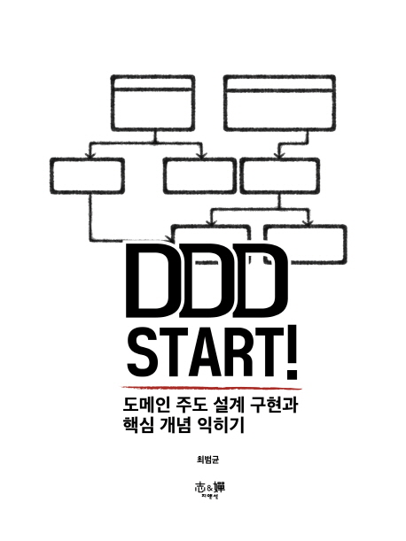

# DDD Start! (도메인 주도 설계 구현과 핵심 개념 익히기)

## 책 사러 가기

절판 😅

[쿠팡](https://coupa.ng/bnd79n)

## 책 소개

DDD의 핵심 개념을 배우고 구현으로 익히기!

이 책은 DDD(도메인 주도 설계)를 처음 접하는 개발자를 위한 책이다. DDD를 실제 업무에 적용할 수 있도록 기본적인 이론을 설명하고 이를 구현한 코드를 바탕으로 입문자가 헤매지 않고 DDD를 학습할 수 있도록 했다.

애그리거트, 엔티티, 리포지토리 등 DDD의 핵심 패턴을 이용해서 도메인 모델을 구현하는 방법을 설명한다. 도메인 모델의 트랜잭션 충돌을 처리하는 기법(선점 잠금, 비선점 잠금)을 살펴보고, 도메인 이벤트를 이용해서 도메인 영역 간의 의존을 낮추는 방법과 명령 모델과 조회 모델을 나누는 기법에 대해서도 배운다.

스프링과 JPA를 이용해서 실제 동작하는 코드를 함께 제공하고 있으므로 DDD를 학습하고 싶은 개발자에게 좋은 길잡이가 될 것이다.

## 출판사 서평

대상 독자

이 책은 DDD를 처음 접하는 개발자를 위한 책이며, DDD 입문자를 위한 책이다. DDD 고수가 되는 법을 알려주는 책은 아니다. 이미 DDD 기초를 마스터했다면 다른 책을 통해 DDD의 심오함을 느끼기 바란다. 아직 DDD는 모르지만 DDD에 관심이 있다면 이 책을 통해서 호기심을 채울 수 있을 것이다.

이 책을 읽는데 개발 경력은 크게 중요하지 않지만, 적어도 3~4년의 개발 경험이 있으면 책의 내용을 이해하는데 도움이 된다. 신입이라면 이 책에서 말하는 일부 내용이 와닿지 않을 수도 있다.

이 책 예제 코드에서 사용하는 언어는 자바이다. 예제에서 사용한 기술로는 스프링 MVC와 JPA(ORM)가 있다. 이 두 기술 자체를 잘 몰라도 책에서 설명하는 내용을 따라가는데 어려움은 없지만 기술에 대한 개요 정도를 알고 있다면 책을 더 잘 이해하는데 도움이 된다. 특히 SQL에만 익숙하다면 JPA가 뭔지 정도는 학습을 하고 이 책을 읽기를 바란다.

DDD가 객체를 기반으로 도메인 모델을 구축하는 내용을 다루지만 객체 지향의 캡슐화, 추상화, 다형성과 같은 주제가 익숙하지 않아도 책을 읽고 이해하는데 큰 문제는 되지 않는다.

이 책의 구성

이 책은 도메인 모델을 이용해서 어플리케이션을 구현하는데 필요한 내용을 다룬다. 전체는 11장으로 구성되어 있는데, 도입부인 1장과 2장에서는 도메인 모델을 구현할 때 알아야 할 기본 내용을 다룬다. 1장에서는 도메인 모델이 무엇인지 알아보고 엔티티와 밸류에 대해 알아본다. 2장은 상위 수준에서 아키텍처의 네 영역과 DIP패턴을 설명하고, 도메인 영역의 구성 요소에 대해 살펴본다.

3장부터 5장은 애그리것과 리포지토리를 설명한다. 애그리것은 복잡한 도메인 모델을 관리 가능한 단위로 묶어주는 역할을 담당하는데 3장에서 애그리것이 무엇이고 구현을 어떻게 하는지 알아본다. 4장에서는 애그리것의 논리적인 저장소인 리포지토리를 구현하는 방법을 알아보고 5장에서는 검색 조건을 위한 스펙, 정렬, 페이징 등 리포지토리의 조회 기능을 구현해본다.

6장은 응용 서비스와 표현 영역에 대해 설명한다. 응용 서비스가 어떻게 도메인 모델을 사용하고 어떤 역할을 수행하는지 알아보고 표현 영역과 응용 서비스의 연동에 대해 설명한다.

7장은 도메인 영역의 구성 요소 중 하나인 도메인 서비스가 필요한 이유와 구현에 대해 설명한다.

8장에서는 애그리것의 트랜잭션 범위에 대해 살펴보고, 애그리것의 트랜잭션 처리를 위해 DBMS를 이용한 선점 잠금과 버전을 이용한 비선점 잠금을 구현하는 방법을 소개한다.

9장은 애그리것과 더불어 가장 중요한 개념 중 하나인 바운디드 컨텍스트에 대한 내용을 다룬다. 바운디드 컨텍스트가 무엇이고, 각 컨텍스트의 통합과 관계에 대해 배워본다.

10장과 11장은 각각 이벤트와 CQRS에 대해 설명한다. 10장은 도메인 이벤트를 이용해서 시스템의 결합도를 낮추고 기능을 확장하는 방법을 설명하고, 비동기로 이벤트를 처리하는 몇 가지 구현 방법을 살펴본다. 11장은 CQRS과 무엇이고 이를 통해 어떤 효과를 얻을 수 있는 설명한다.

예제 코드 다운로드
https://github.com/madvirus/ddd-start

## 저자 소개

최범균

저자 최범균은 나이를 먹어서도 백발에 개발을 하고 싶은 코딩을 좋아하는 개발자다. 좋은 책을 쓰는 것을 꿈꾸고 있고, 꾸준히 블로그와 브런치에 글을 쓰고 있다. ‘스프링4 프로그래밍 입문’, ‘JSP 2.3 웹 프로그래밍’, ‘개발자가 반드시 정복해야 할 객체 지향과 디자인 패턴’ 등의 책을 집필했다.

## 목차

CHAPTER 1 도메인 모델 시작 
도메인 1 
도메인 모델 3 
도메인 모델 패턴 6 
도메인 모델 도출 10 
엔티티와 밸류 17 
엔티티 18 
엔티티의 식별자 생성 20 
밸류 타입 22 
엔티티 식별자와 밸류 타입 29 
도메인 모델에 set 메서드 넣지 않기 30 
도메인 용어 34 
 
CHAPTER 2 아키텍처 개요 
네 개의 영역 37 
계층 구조 아키텍처 40 
DIP 44 
DIP 주의사항 50 
DIP와 아키텍처 52 
도메인 영역의 주요 구성요소  54 
엔티티와 밸류  55 
애그리거트 58 
리포지터리 61 
요청 처리 흐름 65 
인프라스트럭처 개요  66 
모듈 구성 68 
 
CHAPTER 3 애그리거트 
애그리거트 71 
애그리거트 루트 75 
도메인 규칙과 일관성 76 
애그리거트 루트의 기능 구현 80 
트랜잭션 범위 82 
리포지터리와 애그리거트 85 
ID를 이용한 애그리거트 참조 87 
ID를 이용한 참조와 조회 성능 92 
애그리거트 간 집합 연관 94 
애그리거트를 팩토리로 사용하기 98 
 
CHAPTER 4 리포지터리와 모델구현(JPA 중심) 
JPA를 이용한 리포지터리 구현 103 
모듈 위치 104 
리포지터리 기본 기능 구현 104 
매핑 구현 109 
엔티티와 밸류 기본 매핑 구현  109 
기본 생성자  112 
필드 접근 방식 사용 114 
AttributeConverter를 이용한 밸류 매핑 처리 115 
밸류 컬렉션: 별도 테이블 매핑 119 
밸류 컬렉션: 한 개 칼럼 매핑 122 
밸류를 이용한 아이디 매핑 123 
별도 테이블에 저장하는 밸류 매핑  125 
밸류 컬렉션을 @Entity로 매핑하기  129 
ID 참조와 조인 테이블을 이용한 단방향 M-N 매핑 134 
애그리거트 로딩 전략 134 
애그리거트의 영속성 전파 138 
식별자 생성 기능 139 
 
CHAPTER 5 리포지터리의 조회 기능(JPA 중심) 
검색을 위한 스펙 143 
스펙 조합 145 
JPA를 위한 스펙 구현 146 
JPA 스펙 구현 147 
AND/OR 스펙 조합을 위한 구현 150 
스펙을 사용하는 JPA 리포지터리 구현 153 
정렬 구현 155 
페이징과 개수 구하기 구현 160 
조회 전용 기능 구현 162 
동적 인스턴스 생성 162 
하이버네이트 @Subselect 사용 165 
 
CHAPTER 6 응용 서비스와 표현 영역 
표현 영역과 응용 영역 169 
응용 서비스의 역할 171 
도메인 로직 넣지 않기 173 
응용 서비스의 구현 176 
응용 서비스의 크기  176 
응용 서비스의 인터페이스와 클래스 180 
메서드 파라미터와 값 리턴 181 
표현 영역에 의존하지 않기 185 
트랜잭션 처리 187 
도메인 이벤트 처리 188 
표현 영역 190 
값 검증 193 
권한 검사 197 
조회 전용 기능과 응용 서비스 201 
 
CHAPTER 7 도메인 서비스 
여러 애그리거트가 필요한 기능 203 
도메인 서비스 205 
도메인 서비스의 패키지 위치 209 
도메인 서비스의 인터페이스와 클래스 210 
 
CHAPTER 8 애그리거트 트랜잭션 관리 
애그리거트와 트랜잭션 213 
선점 잠금 215 
선전 잠금과 교착 상태 217 
비선점 잠금 218 
강제 버전 증가 227 
오프라인 선점 잠금 228 
오프라인 선점 잠금을 위한 LockManager 인터페이스와 관련 클래스 230 
DB를 이용한 LockManager 구현  233 
 
CHAPTER 9 도메인 모델과 BOUNDED CONTEXT 
도메인 모델과 경계 241 
BOUNDED CONTEXT 242 
BOUNDED CONTEXT의 구현 245 
BOUNDED CONTEXT 간 통합 248 
BOUNDED CONTEXT 간 관계 256 
컨텍스트 맵 259 
 
CHAPTER 10 이벤트 
시스템 간 강결합의 문제  261 
이벤트 개요  265 
이벤트 관련 구성요소  266 
이벤트의 구성  266 
이벤트 용도  269 
이벤트 장점  270 
이벤트, 핸들러, 디스패처 구현 271 
이벤트 클래스  271 
EventHandler 인터페이스  273 
이벤트 디스패처인 Events 구현 275 
흐름 정리 279 
AOP를 이용한 Events.reset() 실행 281 
동기 이벤트 처리 문제 283 
비동기 이벤트 처리 284 
로컬 핸들러의 비동기 실행 285 
메시징 시스템을 이용한 비동기 구현 290 
이벤트 저장소를 이용한 비동기 처리 291 
이벤트 저장소 구현  293 
이벤트 저장을 위한 이벤트 핸들러 구현 299 
REST API 구현 301 
포워더 구현 304 
이벤트 적용 시 추가 고려사항 307 
 
CHAPTER 11 CQRS 
단일 모델의 단점 311 
CQRS 312 
웹과 CQRS 317 
CQRS 장단점 318

---
파트너스 활동을 통해 일정액의 수수료를 제공받을 수 있음