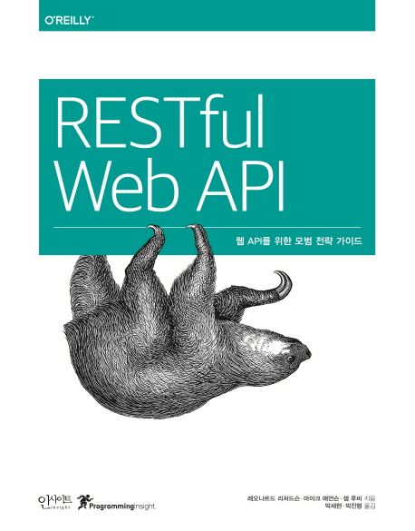

# RESTful Web API (웹 API를 위한 모범 전략 가이드)



## 책 사러 가기

📚[weet](https://smartstore.naver.com/weetbook/products/4776858461)
|
[쿠팡](https://coupa.ng/bnd8or)

## 책 소개

**RESTFUL WEB API**는 시간이 지나도 유용한 REST API를 설계할 수 있는 실전적인 가이드를 제시한다. 이 책을 통해 REST의 개념을 살펴보고 하이퍼미디어 기반 API를 만드는 서로 다른 전략을 배우며 모든 내용을 종합해 단계별로 RESTFUL 웹 API를 설계하게 될 것이다.

## 출판사 서평

“웹 API를 개발할 때 꼭 알아야 두어야 하는 트렌드와 모범 사례”

최근 몇 년간 REST의 인기가 높아지면서 RESTful에 가까운 API가 쏟아져 나오고 있지만 그 아키텍처의 혜택을 여러 가지로 놓치고 있다. 이 책에서는 시간이 지나도 유용한 REST API를 설계할 수 있는 실전적인 가이드를 제시한다. 여러 영역을 아우르는 해법에 집중함으로써 이 책은 세상에서 가장 성공한 분산 컴퓨팅 시스템을 위해 설계된 도구인 월드 와이드 웹을 이용해 강력하고 안전한 애플리케이션을 만드는 방법을 보여준다. 이 책을 통해 REST의 개념을 살펴보고 하이퍼미디어 기반 API를 만드는 서로 다른 전략을 배우며 모든 내용을 종합해 단계별로 RESTful 웹 API를 설계하게 될 것이다.

이 책에서 다루는 내용
* 컬렉션 패턴과 순수 하이퍼미디어 등 API 디자인 전략을 검토한다.
* XMDP와 ALPS 형식이 웹 API가 직면한 의미 체계의 도전을 어떻게 해결하는지 탐색한다.
* 여러 가지 표준 하이퍼미디어 데이터 형식을 배운다.
* API 구현에 HTTP를 사용하는 모범 사례를 배운다.
* JSON-LD와 기타 여러 접근 방식으로 웹 API를 만든다.
* 임베디드 시스템에서 REST를 사용하기 위한 CoAP 프로토콜을 배운다.

## 저자 소개

레오나르드 리처드슨

저자 레오나르드 리처드슨 LEONARD RICHARDSON은 『RUBY COOKBOOK』(O’REILLY)의 지은이다. 뷰티플 수프(BEAUTIFUL SOUP, HTTP://WWW.CRUMMY.COM/SOFTWARE/BEAUTIFULSOUP/)를 비롯해 여러 가지 오픈 소스 라이브러리를 만들었다.

마이크 애먼슨

저자 마이크 애먼슨 MIKE AMUNDSEN은 분산 네트워크 아키텍처, 웹 애플리케이션 개발, 클라우드 컴퓨팅을 주제로 컨설팅과 강연 활동을 하고 있다. 『BUILDING HYPERMEDIA APIS WITH HTML5 AND NODE』(O’REILLY)를 비롯해 여러 권의 책을 집필했다.

샘 루비

저자 샘 루비 SAM RUBY는 W3C HTML 워킹 그룹 공동 의장을 맡고 있고 아파치 소프트웨어 재단의 여러 오픈 소스 소프트웨어 프로젝트에 기여하고 있다. IBM 이머징 테크놀로지 그룹의 시니어 테크니컬 스태프 멤버다.

박세현

역자 박세현은 맥이 좋아 취미로 개발하다 정신 차려 보니 개발로 먹고 살고 있는 평민 개발자. 잠시 고향과도 같던 맥과 IOS 개발을 떠났다가 깊은 후회 후, 다시 IOS 개발로 돌아와 행복한 시간을 보내고 있다. 요즘엔 판교에서 서식 중.

박진형

역자 박진형은 연세대학교 수학과, 컬럼비아 대학 컴퓨터과학과 석사를 졸업 후 팬시(FANCY.COM) 서비스를 만드는 뉴욕 스타트업 THING DAEMON, INC에 IOS 엔지니어로 합류 후, 현재는 백엔드와 프런트엔드 가릴 것 없이 닥치는 대로 모든 개발을 다 하는 잡부(?)로 일을 하고 있다.

## 목차
```
옮긴이의 글
추천사
머리말
감사의 글

1. 웹 서핑하기
에피소드 1: 광고판
에피소드 2: 홈페이지
에피소드 3: 링크
에피소드 4: 폼과 리다이렉트
애플리케이션 상태
리소스 상태
연결
웹은 뭔가 특별하다
의미 체계(semantic)의 문제

2. 간단한 API
HTTP GET: 확실한 시도
HTTP 응답 읽기
JSON
Collection+JSON
API 작성하기
HTTP POST: 리소스는 어떻게 탄생할까
제약 조건으로 자유해짐
애플리케이션 의미가 의미적 차이를 만든다

3. 리소스와 표현
무엇이든 리소스가 될 수 있다
표현은 리소스 상태를 설명한다
표현은 양방향으로 전송된다
많은 표현이 있는 리소스
HTTP의 프로토콜 의미
어떤 메서드를 사용해야 할까?

4. 하이퍼미디어
하이퍼미디어 형식으로서의 HTML
URI 템플릿
URI 대 URL
Link 헤더
하이퍼미디어는 무엇을 위한 것인가
가짜 하이퍼미디어를 조심하자!
의미 체계의 문제: 잘 대응하고 있는가?

5. 도메인 특화 설계
Maze+XML: 도메인 특화 설계
Maze+XML은 어떻게 동작하나
미로 컬렉션
Maze+XML이 API일까?
클라이언트 #1: 게임
Maze+XML 서버
클라이언트 #2: 지도 제작기
클라이언트 #3: 허풍쟁이(The Boaster)
클라이언트는 그들이 원하는 일을 한다
표준 확장하기
지도 제작기의 결점
메타포로서의 미로
의미 체계의 문제 맞닥뜨리기
도메인 특정 설계는 어디에 있는가?
도메인 특정 설계를 찾을 수 없다면 만들지 말라
API 클라이언트의 종류

6. 컬렉션 패턴
컬렉션은 무엇인가?
Collection+JSON
(일반) 컬렉션은 어떻게 동작하는가
AtomPub(Atom Publishing Protocol)
의미 체계의 문제: 잘 대응하고 있는가?

7. 순수 하이퍼미디어 설계
왜 HTML인가?
HTML의 기능
마이크로포맷
hMaze 마이크로포맷
마이크로데이터
리소스 상태 변경하기
하이퍼미디어의 대체재는 미디어다
HTML의 제약
하이퍼텍스트 애플리케이션 언어
사이렌
의미 체계의 문제: 잘 대응하고 있는가?

8. 프로파일
클라이언트는 문서를 어떻게 찾는가?
프로파일이 뭘까?
프로파일에 연결하기
프로파일은 프로토콜 의미 체계를 설명한다
프로파일은 애플리케이션 의미 체계를 설명한다
XMDP: 기계가 이해할 수 있는 첫 번째 프로파일 형식
ALPS
JSON-LD
임베딩된 문서
요약

9. 설계 절차
2단계 설계 절차
7단계 설계 절차
예제: You Type It, We Post It
몇 가지 설계 충고
기존 API에 하이퍼미디어 추가하기
앨리스의 두 번째 모험

10. 하이퍼미디어 동물원
도메인 특화 형식
컬렉션 패턴 형식
순수 하이퍼미디어 형식
GeoJSON: 문제가 되는 유형
의미 체계 동물원

11. API를 위한 HTTP
새로운 HTTP/1.1 설계 명세서
응답 코드
헤더
표현들 사이에서 선택하기
HTTP 성능
업데이트를 못한 문제 피하기
인증
HTTP 확장
HTTP 2.0

12. 리소스 설명과 연결된 데이터
RDF
설명 전략을 사용해야 할 때
리소스 유형
RDF 스키마
연결된 데이터로의 이동
JSON-LD
히드라
XRD 종류들
온톨로지 동물원
결론: 설명 전략은 살아 있다!

13. CoaP: 임베디드 시스템을 위한 REST
CoaP 요청
CoaP 응답
메시지의 종류
지연된 응답
멀티캐스트 메시지
CoRE 연결 형식
결론: HTTP가 없는 REST

부록 A. 상태 목록(Status Codex)
부록 B. 헤더 목록(Header Codex)
부록 C. API 설계자를 위한 필딩 논문 가이드
용어 해설
찾아보기
```

---
파트너스 활동을 통해 일정액의 수수료를 제공받을 수 있음