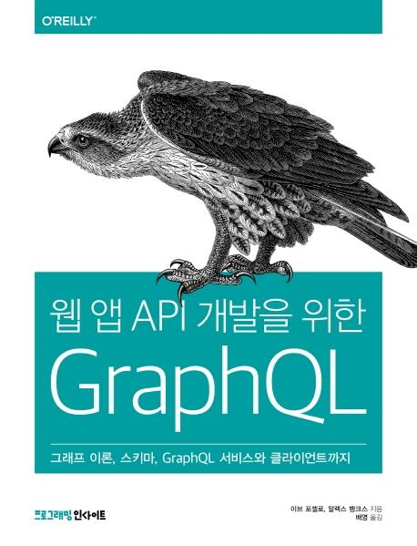

# 웹 앱 API 개발을 위한 GraphQL (그래프 이론, 스키마, GraphQL 서비스와 클라이언트까지)

## 책 사러 가기

[쿠팡](https://coupa.ng/bnd8vO)

## 책 소개

“선언형 데이터 페치 방법과 GRAPHQL 서비스 핵심 가이드”

GRAPHQL은 REST API와 비교해 데이터를 가져오는 기능이 훨씬 우수하여 웹 앱 API의 새로운 지평을 열었다고 평가받고 있으며, 이를 활용하는 기업도 깃허브, 뉴욕타임스, IBM, 트위터, 옐프(YELP) 등으로 빠르게 늘어가고 있다.

이 책은 혁신적인 데이터 페치 기술이 된 GRAPHQL에 관한 실용적인 안내서로서 자바스크립트로 GRAPHQL 서비스를 구현하는 방법을 다룬다. 저자들은 그래프 이론, 그래프의 데이터 구조부터 스키마, GRAPHQL 서비스, 아폴로(APOLLO) 클라이언트까지 웹 서비스 아키텍처를 자체적으로 구성할 수 있는 GRAPHQL의 장점과 트렌드, 모범 기법 들을 알려준다. 이제 막 GRAPHQL을 배우기 시작한 개발자뿐 아니라, 이미 기술은 알지만 가장 최신의 베스트 프랙티스를 습득하길 원하는 웹 개발자라면 곁에 두고 참고할 만한 책이다.

## 출판사 서평

이 책에서 다루는 내용

- 그래프 이론과 널리 알려진 그래프 최신 예제 살펴보기
- 데이터베이스의 쿼리 메서드를 인터넷에 적용하는 방법
- 사진 공유 애플리케이션에서 사용하는 스키마 만들기
- 자바스크립트로 완전한 기능을 갖춘 GraphQL 서비스 만들기
- Apollo로 클라이언트 구현하기
- 실제 제품용 GraphQL API와 클라이언트를 만드는 방법

## 저자 소개

저자 이브 포셀로, 알렉스 뱅크스

포셀로와 뱅크스는 캘리포니아 타호 시를 기반으로 활동하는 소프트웨어 엔지니어이자 교육자다. 문 하이웨이(MOON HIGHWAY)라는 회사를 설립하여 기업 고객을 위한 맞춤 훈련 커리큘럼을 개발하고 링크드인 러닝 사이트에 온라인 강좌를 제공하고 있다. 오라일리 미디어의 《러닝 리액트》도 함께 썼다.

역자 배영
N TECH SERVICE에서 2년 반 동안 네이버 서비스 UI를 개발했고, 현재 네이버에서 플레이스 서비스 개발에 참여하고 있다. 업무에서 배운 내용을 글로 정리하고 혼자 웹 한쪽 구석에 쌓아 두다가 같이 일하는 동료들과 가끔 공유하는 것을 좋아한다.

## 목차
1장 GraphQL에 오신 것을 환영합니다 
 
1.1 GraphQL이란? 
1.1.1 GraphQL 명세 
1.1.2 GraphQL 설계 원칙 
1.2 GraphQL의 탄생 
1.3 데이터 전송의 역사 
1.3.1 RPC 
1.3.2 SOAP 
1.3.3 REST 
1.4 REST의 단점 
1.4.1 오버페칭 
1.4.2 언더페칭 
1.4.3 REST 엔드포인트 관리 
1.5 실생활에서의 GraphQL 
1.5.1 GraphQL 클라이언트 
 
2장 그래프 이론 
 
2.1 그래프 이론 어휘 
2.2 그래프 이론의 역사 
2.3 트리는 그래프다 
2.4 실생활에서의 그래프 
 
3장 GraphQL 쿼리어 
 
3.1 GraphQL API 툴 
3.1.1 GraphiQL 
3.1.2 GraphQL 플레이그라운드 
3.1.3 공용 GraphQL API 
3.2 GraphQL 쿼리 
3.2.1 엣지와 연결 
3.2.2 프래그먼트 
3.3 뮤테이션 
3.3.1 쿼리 변수 사용하기 
3.4 서브스크립션 
3.5 인트로스펙션 
3.6 추상 구문 트리 
 
4장 스키마 설계하기 
 
4.1 타입 정의하기 
4.1.1 타입 
4.1.2 스칼라 타입 
4.1.3 열거 타입 
4.2 연결과 리스트 
4.2.1 일대일 연결 
4.2.2 일대다 연결 
4.2.3 다대다 연결 
4.2.4 여러 타입을 담는 리스트 
4.3 인자 
4.3.1 데이터 필터링 
4.4 뮤테이션 
4.5 인풋 타입 
4.6 리턴 타입 
4.7 서브스크립션 
4.8 스키마 문서화 
 
5장 GraphQL API 만들기 
 
5.1 프로젝트 세팅 
5.2 리졸버 
5.2.1 루트 리졸버 
5.2.2 타입 리졸버 
5.2.3 인풋 &amp; 열거 타입 사용하기 
5.2.4 엣지와 연결 
5.2.5 커스텀 스칼라 
5.3 apollo-server-express 
5.4 컨텍스트 
5.4.1 MongoDB 설치하기 
5.4.2 컨텍스트에 데이터베이스 추가하기 
5.5 깃허브 인증 
5.5.1 깃허브 OAuth 설정 
5.5.2 권한 부여 과정 
5.5.3 githubAuth 뮤테이션 
5.5.4 사용자 권한 인증 
5.6 마치며 
 
6장 GraphQL 클라이언트 
 
6.1 GraphQL API 사용하기 
6.1.1 fetch 요청 
6.1.2 graphql-request 
6.2 아폴로 클라이언트 
6.3 React와 아폴로 클라이언트 
6.3.1 프로젝트 설정 
6.3.2 아폴로 클라이언트 설정 
6.3.3 Query 컴포넌트 
6.3.4 Mutation 컴포넌트 
6.4 인증 
6.4.1 사용자 권한 인증 
6.4.2 사용자 식별 
6.5 캐시 작업 
6.5.1 fetch 방침 
6.5.2 캐시 유지 
6.5.3 캐시 업데이트 
 
7장 실제 제품을 위한 GraphQL 
 
7.1 서브스크립션 
7.1.1 서브스크립션 작업 
7.1.2 서브스크립션 데이터 사용하기 
7.2 파일 업로드 
7.2.1 서버 파일 업로드 기능 구현하기 
7.2.2 클라이언트 사진 게시 기능 구현하기 
7.3 보안 
7.3.1 요청 타임아웃 
7.3.2 데이터 제한 
7.3.3 쿼리 깊이 제한 
7.3.4 쿼리 복잡도 제한 
7.3.5 아폴로 엔진 
7.4 다음 단계 
7.4.1 점진적 마이그레이션 
7.4.2 스키마 주도 개발 
7.4.3 GraphQL 행사 모음 
7.4.4 커뮤니티 
7.4.5 커뮤니티 슬랙 채널

---
파트너스 활동을 통해 일정액의 수수료를 제공받을 수 있음